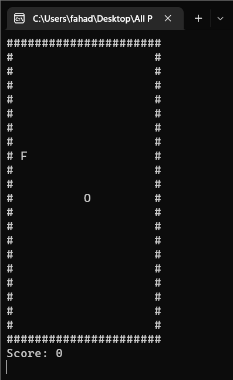
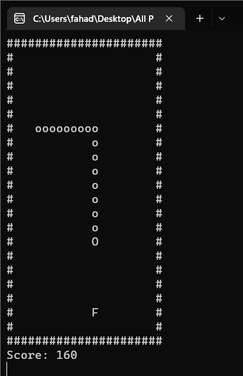
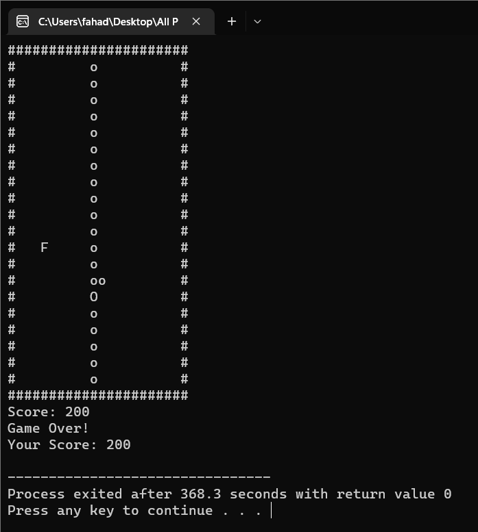

# 🐍 Snake Game in C++

Welcome to the classic **Snake Game** built in C++!  
This console-based version brings back nostalgia with smooth gameplay and a simple scoring system.

---

## 🎓 About the Project
This game was created as a project for the **Programming Fundamentals** course during the **1st semester of BS Computer Science** at **Salim Habib University**.  
It showcases the basics of C++ programming, including loops, conditionals, and console-based graphics.

---

## 🎮 Game Features
- Smooth movements with no screen flickering.
- Classic fruit collection and scoring system.
- Screen wrapping for continuous play.
- Easy-to-use controls.
- Tail growth on eating fruit.

---

## 🎲 Controls
- **W** - Move Up  
- **A** - Move Left  
- **S** - Move Down  
- **D** - Move Right  
- **X** - Exit Game  

---

## ⚙️ Requirements
- **C++ Compiler** (e.g., g++, MinGW)
- **Windows Console** (for `windows.h` dependency)

---

## 🚀 How to Run
1. **Clone the repository:**
   ```sh
   git clone https://github.com/FahadImdad/snake-game-cpp.git
   cd snake-game-cpp
   ```

2. **Compile the code:**
   ```sh
   g++ snake_game.cpp -o snake_game.exe
   ```

3. **Run the game:**
   ```sh
   ./snake_game.exe
   ```

---

## 🖼️ Gameplay Preview
### Start Screen  


### Gameplay  


### Game Over  


> **Note:** Make sure to save the screenshots in the `Images` folder within the project directory.  
> Alternatively, upload the images to the GitHub repository and use the raw URLs for better display.

---

## 📂 File Structure
```
snake-game-cpp/
├── Images/
│   ├── screenshot1.png
│   ├── screenshot2.png
│   └── screenshot3.png
├── LICENSE              # MIT License file
├── README.md            # Game description and setup
├── snake_game.cpp       # Main game logic
└── snake_game.exe       # Compiled executable
```

---

## 🛠️ Improvements & Future Updates
- High score tracking system
- Increasing speed as the score rises
- Obstacles for more challenging gameplay
- Sound effects for fruit collection and game-over events

---

## 🤝 Contributing
Contributions are welcome!  
Feel free to open issues or submit pull requests to make the game even more awesome.

---

## 📜 License
This project is licensed under the **MIT License** (2025).  
See the [LICENSE](LICENSE) file for details.

---

## 📧 Contact
For any queries or suggestions:  
**Muhammad Fahad Imdad** - [fahadimdad966@gmail.com](mailto:fahadimdad966@gmail.com)  
[LinkedIn](https://www.linkedin.com/in/muhammadfahadimdad/) | [GitHub](https://github.com/FahadImdad) | [Website](https://www.fahadimdad.com/)

---

## ⭐ Acknowledgements
Special thanks to the C++ community for continuous support and inspiration.

---

## 🌟 Don't forget to leave a star if you like this project!

---

### 🔥 Happy Gaming! 
